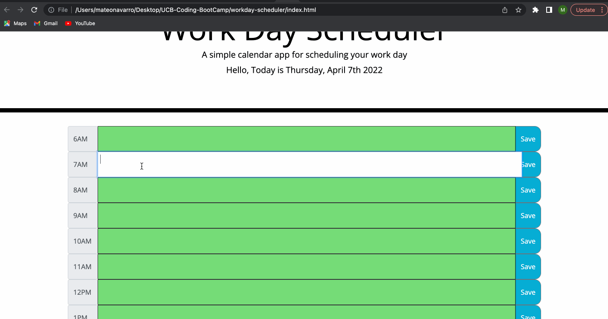

# Workday Scheduler

## Description

Planner to schedule all your work day needs! Schedule projects, meetings, or even breaks. 

## Visuals

## Usage 

Workday planner schedules from 6am to 6pm. Time block for the current hour will show up in red, past time blocks will show up in gray, and future time blocks will show up in green. Click on your desired time block and type to add your scheduling information. Dont forget to press the save button to save your work day calander! After those steps are complete, your planner is ready to help you navigate your busy work day!

## Links

1. https://github.com/mateonav98/workday-scheduler
2. https://mateonav98.github.io/workday-scheduler/

## Code

1. HTML
2. CSS
3. JavaScript
4. JQuery

## Author

Mateo Navarro

LinkedIn: https://www.linkedin.com/in/mateonav

GitHub: https://github.com/mateonav98